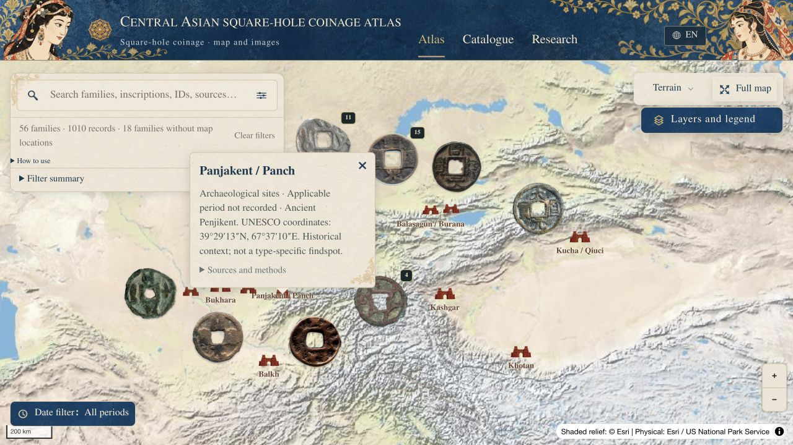

# Central Asian Square-Hole Coinage Atlas

A map and catalogue for exploring the square-hole coin traditions of Central Asia.

This project grew out of collecting coins and trying to compare records scattered across specialist databases and catalogues. A photograph is useful; its source, attribution and geographical context make it possible to ask better questions. The atlas brings those pieces together while keeping the original records within reach.



## Explore

Start with the map, select a city collection, then open a coin family and its photographs. Catalogue provides another route through the material, including records without a mapped location. Research collects the bibliography, coverage notes and plans for the next edition.

- Browse 56 editorial families, 120 source/catalogue groups and 1,010 records with 1,013 images.
- Search by family, source record and historical place; combine dates, regions and source filters.
- Compare original photographs and follow their source links.
- Switch between English, Chinese and Russian.
- Use the mobile detail panel in summary, half-height or reading mode.

The separate research-material gallery contains 701 related, held or excluded records. Record totals describe the imported material; several source pages can refer to the same physical coin.

## How the material is organised

The project covers Central Asian and related Inner Asian traditions derived from Chinese-style square-hole cash. Sogdiana, Chach, Ferghana, Semirechye, the Tarim region and neighbouring contact zones form the main working scope.

Families are editorial groupings. Catalogue groups retain their source identities. Historical locations keep their stated roles, and uncertain dates and competing attributions remain visible. A city anchor does not automatically establish a mint or findspot.

The current map has 14 registered places, with 38 families mapped and 18 accessible through the catalogue. Verified hoard and findspot layers are still awaiting evidence. The fuller acquisition history and source policies are in [Corpus notes](docs/corpus-notes.md).

## Run locally

Requires Node.js 22.13 or later, pnpm 11.25 and Python 3. Install Pillow for the data scripts.

```sh
git clone https://github.com/gugujilulu/Sogdian-coins-website.git
cd Sogdian-coins-website
pnpm install --frozen-lockfile
pnpm dev
```

The development server prints its address. For a production build, run `pnpm build`; `pnpm start` serves the generated worker locally. The hosting configuration remains in `.openai/hosting.json`.

## Check the data and application

```sh
python -m pip install Pillow
python scripts/validate-atlas.py
pnpm exec tsc --noEmit
node --test tests/phase1-final.test.mjs
pnpm build
```

[The release review](docs/reviews/phase1-final/README.md) records the checks performed and their limits. [The mobile follow-up](docs/reviews/phase1-final/R1/README.md) includes the corrected reading order and production screenshots.

## Project structure

| Path | Purpose |
| --- | --- |
| `app/`, `components/atlas/` | Map, catalogue, research pages and detail panels |
| `lib/` | Search, filtering, display text and map layout |
| `public/data/atlas.json` | Normalised display export |
| `research/` | Source snapshots, provenance and review decisions |
| `db/schema.sql` | Research database model |
| `scripts/` | Collection, validation and reproducible exports |

The application uses React, TypeScript, MapLibre GL and Vinext. Python scripts build the display export and SQLite research database. [Development notes](docs/project-notes.md) explain the decisions behind the data model and interactions.

## Sources and image credits

Photographs retain their original credits and source links. Map attribution remains visible in the application. A public repository does not change the rights attached to third-party photographs or source records; rights are recorded with the material.

Source policies are documented in `research/source-provenance-policy.json` and `research/source-authorities.json`. Questions and corrections can be raised through [GitHub issues](https://github.com/gugujilulu/Sogdian-coins-website/issues). Please include the record ID and the source behind a proposed correction.
